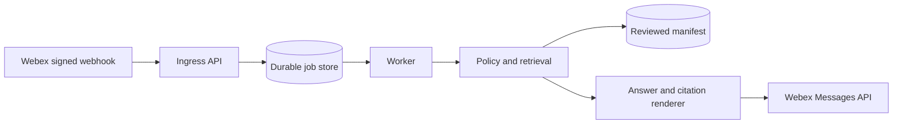

# Governed Webex Knowledge Assistant

A reference implementation for a Webex bot that answers questions from reviewed knowledge. The
reference implementation verifies signed webhook payloads, enforces an exact space policy,
deduplicates work, retrieves only eligible evidence, redacts sensitive input, cites approved
sources, and abstains when the evidence is insufficient.

The example corpus is fictional and synthetic. It contains no production conversations, people,
spaces, customer data, operational URLs, or organization-specific knowledge.

## What is included

- FastAPI ingress with Webex webhook signature verification over the raw request bytes.
- Exact group-space allowlisting, an optional exact direct-message sender allowlist, mention checks,
  and self-message suppression.
- A durable database queue with bounded retries and dead-letter state.
- PostgreSQL for hosted deployments and SQLite for development.
- A strict manifest schema for source class, audience, review status, answerability, and citation
  policy.
- Deterministic retrieval with conflict detection, safe citation rendering, and explicit
  abstention.
- Redaction before retrieval and a no-automatic-retry boundary for ambiguous message posts.
- Docker Compose, migrations, GitHub-hosted CI, synthetic tests, and a public-release scanner.

No model provider is included in version 0.1. A future provider may improve phrasing, but it must
not widen source eligibility, audience, citation, or abstention policy.

## Five-minute architecture



The API verifies the exact raw request body, rejects malformed in-scope events, acknowledges
out-of-scope events without queueing them, and records only a validated message-created event and
its bounded message ID before returning `202`. The worker fetches the authoritative message and
requires its ID, room ID, room type, and sender ID to be present and consistent before applying
authorization. It then redacts the question, retrieves from the reviewed manifest, and posts one
answer or abstention. Explicit
non-acceptance such as rate limiting is retried; a post that may have reached Webex is marked
ambiguous and is never automatically repeated.

See [Architecture](docs/ARCHITECTURE.md) for system, container, sequence, and knowledge-policy
views. See [Deployment](docs/DEPLOYMENT.md) for configuration and release boundaries.

## Local quick start

Requirements: Python 3.12 and a Webex bot created through the official
[Webex developer portal](https://developer.webex.com/create/docs/bots).

```bash
python3 -m venv .venv
. .venv/bin/activate
python -m pip install --upgrade pip
python -m pip install -e '.[dev]'
cp .env.example .env
webex-knowledge-assistant migrate
webex-knowledge-assistant validate-manifest
```

For a configuration-only smoke test, keep `ENVIRONMENT=development` and use synthetic values. To
receive real Webex events, set the bot token, webhook secret, bot person ID, and exact allowed space
IDs through runtime environment variables. If direct messages are enabled, also set an exact
sender-person allowlist. Never commit these values.

Run the API and worker in separate terminals:

```bash
webex-knowledge-assistant api
webex-knowledge-assistant worker
```

The API exposes:

- `GET /livez` for process liveness;
- `GET /readyz` for database and manifest readiness; and
- `POST /webhooks/webex` for signed Webex webhook events.

## Hosted deployment

Create a `.env` outside source control and set `POSTGRES_PASSWORD`, the bot token, webhook secret,
bot person ID, and exact space allowlist. Compose exposes each secret only to the role that needs
it: the API receives the webhook secret, the worker receives the bot credentials, and migration
receives no Webex credential. Then run:

```bash
docker compose up --build -d
docker compose ps
curl --fail http://127.0.0.1:8000/readyz
```

Expose the webhook endpoint only through an owned HTTPS origin. Register a Webex webhook secret
and configure the same value as `WEBEX_WEBHOOK_SECRET`. Do not use a temporary tunnel as an
always-on deployment.

## Knowledge manifest

Start with [the synthetic example](examples/knowledge/sample-manifest.json). An answerable record
is accepted only when its source is reviewed and currently effective, its audience is public, and
its source class is `public` or `synthetic`. Restricted, expired, not-yet-effective, audit-only, and
candidate material is never answered.

Use original or redistribution-approved material. Access to a document does not by itself grant
permission to publish its contents.

## Verification

```bash
make verify
```

The gate checks formatting, lint, behavioral tests and coverage, package builds, manifest policy,
generic privacy and credential patterns, reachable Git history, symlink topology, runtime
artifacts, and built archives. Release owners may also supply an organization-specific denylist
stored outside the repository to `verify_public_release.py --denylist`.

## License and release boundary

This project is licensed under the [Apache License 2.0](LICENSE). Its public Git history begins with
the reviewed, generalized source tree and does not inherit history from a private implementation.
Run `make publication-check` before every release; `make verify` includes that final license and
public-boundary gate.

Publishing this source does not create a Webex bot, register a webhook, deploy a service, load an
operator's knowledge, or grant access to any environment. Runtime configuration, credentials,
production identifiers, conversation data, and private knowledge remain outside the repository.

## Security and support

- [Security policy](SECURITY.md)
- [Contribution guide](CONTRIBUTING.md)
- [Support boundary](SUPPORT.md)
- [Apache License 2.0](LICENSE)
