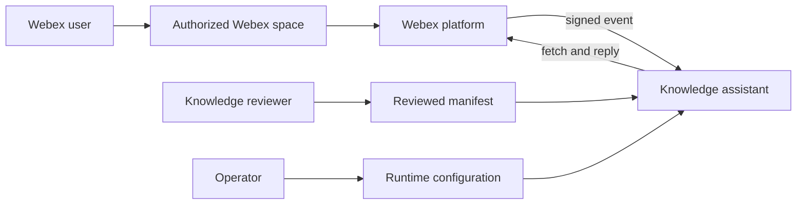
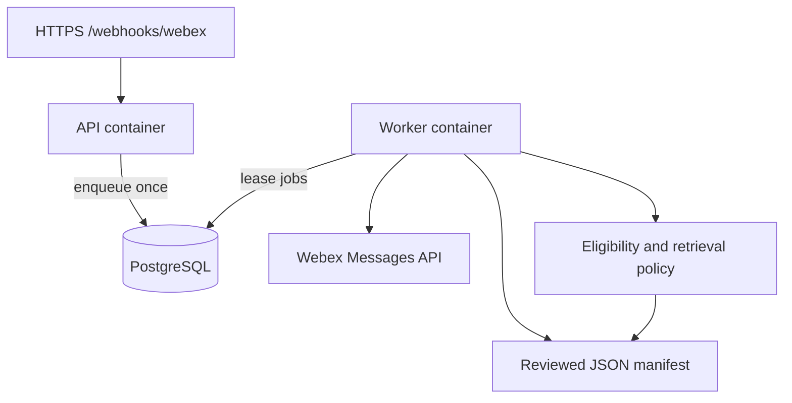
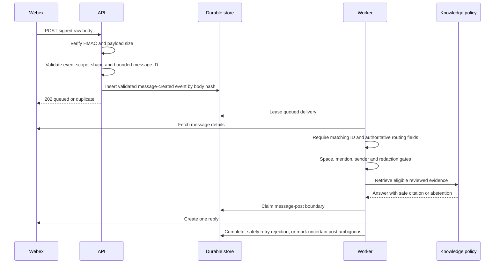
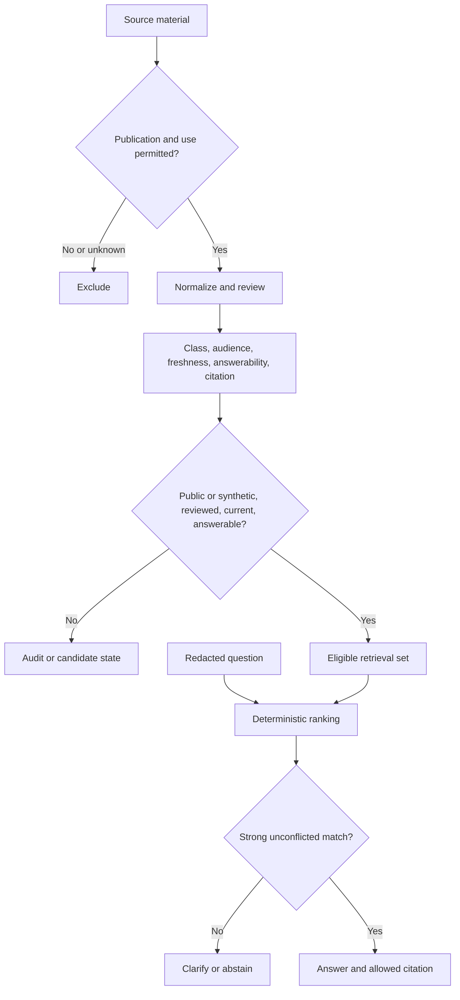

# Architecture

The assistant keeps Webex delivery, knowledge eligibility, and optional reasoning as separate trust
boundaries. These diagrams use generic components and synthetic examples so the repository can be
reviewed without exposing a deployment or knowledge corpus.

## 1. System context

Webex transports messages. Reviewers decide what evidence is answerable. Operators configure exact
spaces, credentials, storage, and deployment. None of those roles automatically grants another
role's authority.

## 2. Deployable containers

The API performs bounded admission work. The worker owns network calls and answer processing. The
same image runs migrations, API, and worker commands. SQLite is supported for local development,
not as shared hosted storage.

## 3. Message sequence

Webhook retries cannot create a second queued delivery. A message is claimed immediately before
posting. Malformed in-scope payloads are rejected, while valid out-of-scope events are acknowledged
without persistence. The untrusted webhook envelope can select only a validated message ID to
fetch; it cannot supply or override room, room type, or sender authorization data. A connection
failure before sending or
an explicit `429` releases the posting claim and requeues the job; `Retry-After` is honored up to
five minutes. A permanent client rejection is dead-lettered and also releases the claim. A read or
write transport failure, `408`, or `5xx` response after a post begins has an uncertain outcome, so
it becomes ambiguous instead of being posted again automatically. Read-only fetch failures remain
safe to retry.

## 4. Knowledge and guardrail flow

Conversation context and model output are not evidence. A future reasoning provider may operate
only on the evidence selected by this policy and must pass the same final citation and safety gate.

## Data locations

| Data | Repository | Process memory | Runtime database | External runtime store |
|---|---:|---:|---:|---:|
| Application code and synthetic tests | Yes | Loaded/executed | No | No |
| Reviewed public/synthetic manifest | Yes | Loaded at start | No | No |
| Minimal delivery metadata and deduplication state | No | Transient | Yes | No |
| Current message text fetched from Webex | No | Transient during processing | No | No |
| Bot token and webhook secret | No | Yes | No | Operator-managed secret store |
| Raw conversation exports | No | No | No | No |
| Application logs | No | Transient | No | Optional operator-managed log sink |

The queue retains only fixed `messages`/`created` constants and the validated, bounded message ID
needed to fetch a message. Authorization uses only the message returned by the Webex Messages API;
fetched message text and routing metadata are not persisted. Operators must still define retention
and deletion for delivery metadata and deduplication rows because those identifiers can be
deployment-sensitive.
